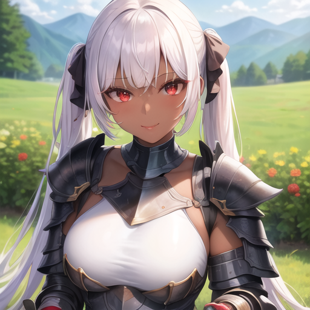

# Image Fidelity Data Analysis (WIP)

This is an analysis on how floating point precision loss affects image fidelity when it comes to image rendering using Stable Diffusion.
* Compares pixels of rendered images between the fp16 model and the fp32 model
* Includes with VAE Bake in and without

## fp16 vs fp32 Image Rendered:

### VAE included

<p align="center">
  
  
</p>

- [Left image](https://github.com/azher-alnabi/stable-diffusion-float-point-analysis/blob/main/input/anything-v4.0-pruned-fp16-vae.png) was rendered using the [fp16 model](https://huggingface.co/andite/anything-v4.0/blob/main/anything-v4.0-pruned-fp16.ckpt) + [VAE](https://huggingface.co/andite/anything-v4.0/blob/main/anything-v4.0.vae.pt) Bake in
- [Right image](https://github.com/azher-alnabi/stable-diffusion-float-point-analysis/blob/main/input/anything-v4.0-pruned-fp32-vae.png) was rendered using the [fp32 model](https://huggingface.co/andite/anything-v4.0/blob/main/anything-v4.0-pruned-fp32.ckpt) + [VAE](https://huggingface.co/andite/anything-v4.0/blob/main/anything-v4.0.vae.pt) Bake in

### VAE not included

<p align="center">
  
  
</p>

- [Left image](https://github.com/azher-alnabi/stable-diffusion-float-point-analysis/blob/main/input/anything-v4.0-pruned-fp16.png) was rendered using the [fp16 model](https://huggingface.co/andite/anything-v4.0/blob/main/anything-v4.0-pruned-fp16.ckpt)
- [Right image](https://github.com/azher-alnabi/stable-diffusion-float-point-analysis/blob/main/input/anything-v4.0-pruned-fp32.png) was rendered using the [fp32 model](https://huggingface.co/andite/anything-v4.0/blob/main/anything-v4.0-pruned-fp32.ckpt)

## Parameters used in fabrication of both fp16 and fp32 Images:

Positive Prompt:
```
1girl, bangs, bracelet, dark skin, day, jewelry, lips, twin tail hair, looking at the viewer, nature, outdoors, sitting, smile, red lips, white hair, masterpiece, highres, absurdres, ((black plated armor)), (black plate armor), red eyes, stunning, beautiful, lovely, rich, wealthy, portrait, vibrant
```

Negative Prompt:
```
(worst quality, low quality:1.4), (monochrome:1.4), 3d, text, frame, censored, jpeg artifacts, grids
```

* Sampling Method: DPM++ 2M Karras
* Sampling Steps: 30
* Width: 512
* Height: 512
* CFG Scale: 7
* Seed: 815317003

## External Resources Used:

### Stable Diffusion Web UI:

GUI used to render images found here: [GUI](https://github.com/AUTOMATIC1111/stable-diffusion-webui)

### Anything v4.0 pruned fp16 Checkpoint:

Model link can be found here: [Checkpoint](https://huggingface.co/andite/anything-v4.0/blob/main/anything-v4.0-pruned-fp16.ckpt)

### Anything v4.0 pruned fp32 Checkpoint:

Model link can be found here: [Checkpoint](https://huggingface.co/andite/anything-v4.0/blob/main/anything-v4.0-pruned-fp32.ckpt)

### Variational Autoencoder (VAE) Baked into fp16 & fp32 Models:

VAE link can be found here: [VAE](https://huggingface.co/andite/anything-v4.0/blob/main/anything-v4.0.vae.pt)
This VAE was baked in to both models prior to analysis